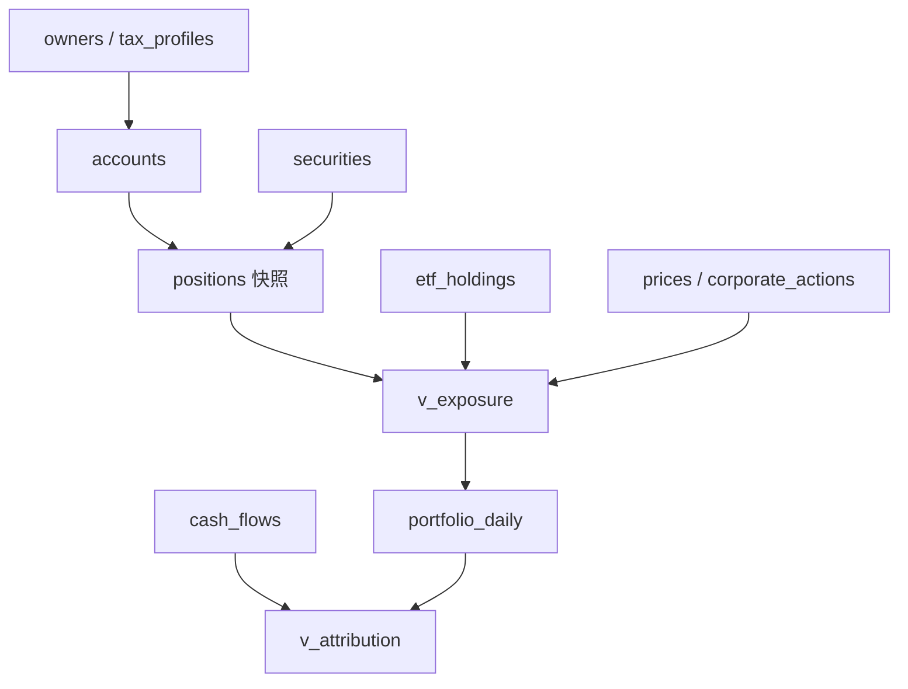
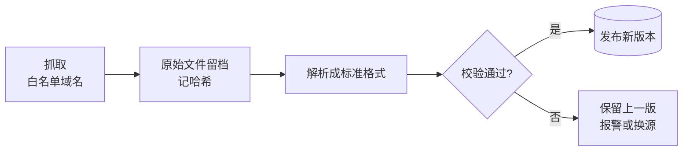
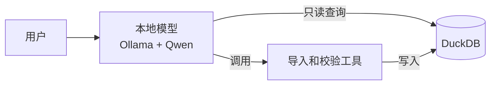
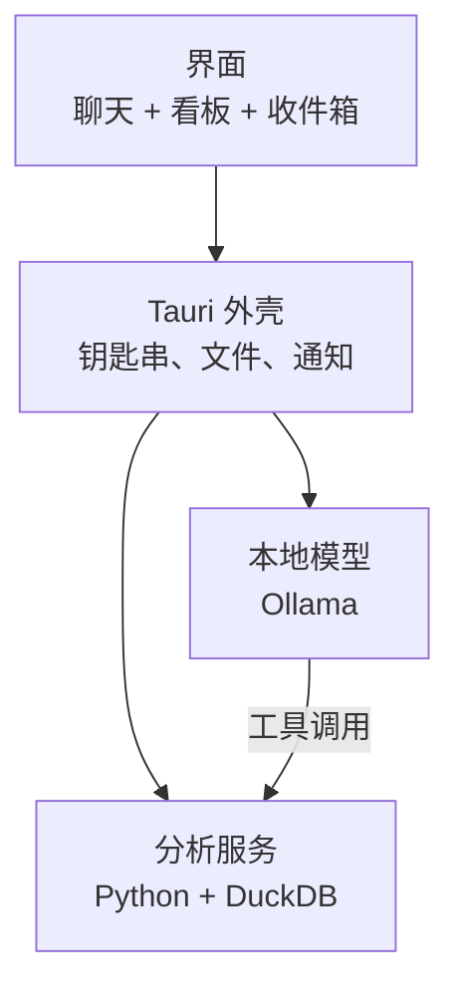
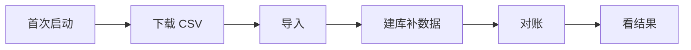

# Glassfolio 需求与设计文档

*See through your portfolio.*

版本：2026-09-23。本文档是讨论记录的整合版，面向编码助手。阶段划分和部分数值（阈值、容差）是初始建议，实现中可以调整。

---

## 0. 项目概述

**要解决的问题**：账户分散在多家券商和多种账户类型（应税、Traditional IRA、Roth IRA、401k），还包括家人的账户；同一家公司（比如 NVDA）既被直接持有，又藏在多只 ETF 和基金里。今天要回答“我实际持有多少 NVDA”需要手算三步，而且算不准。

**定位**：Monarch 这类工具管“你有多少钱”；Glassfolio 管“你的钱实际押在哪些公司、为什么在变、税后值多少”。数据只在本机，由本机模型处理。

**核心能力**

1. 公司级穿透：把 ETF 和基金拆到个股，汇总每家公司的真实敞口。
2. 敞口变化归因：每只股票的敞口变化拆成股价涨跌、你的资金流动、ETF 调仓三部分。
3. 税后口径：按账户类型和“人”设税率假设，给出税前和税后两套数字。
4. 可信度：所有结果先对账，通过才展示，并带可信度标记。
5. 本地 AI 助手：负责导入、校验、问答、向你确认不确定的数据。

**不做什么**：不做交易和下单；不追求全自动同步；不做净资产和记账（交给 Monarch Money 这类工具）；不导入银行或交易流水。

---

## 1. 核心决策一览

| 主题 | 决策 |
| --- | --- |
| 应用形态 | Tauri 桌面应用（前端 React）；MVP 先做只监听 127.0.0.1 的本地网页，前端代码之后直接装进 Tauri |
| 分析层 | Python + DuckDB + dbt-duckdb，作为 Tauri 的 sidecar 进程 |
| 存储 | DuckLake（本地 DuckDB 文件做目录）；数据库从第一天就加密 |
| 本地模型 | Ollama 运行时，默认 Qwen 3.6 27B 的 MLX 版本；模型层做成统一接口 |
| 云端模型 | P2 才做，自带 API key，默认关闭 |
| 模型接入方式 | 自写一个薄的 MCP server，只暴露少数窄工具 |
| 资金流动 | 不导入流水；用快照差额推算，说不清的由 AI 在聊天里向用户确认 |
| 成本基础 | 直接用券商导出的成本和 lot 明细，不从交易重建 |
| 行情 | 每日收盘价，Tiingo 为主 |
| ETF 成分 | 发行商官网文件为主，SEC N-PORT 兜底，拿不到的用指数代理 |
| 视觉 | 苹果 Liquid Glass 风格；玻璃只用在框上，数字放在接近实色的底上 |

---

## 2. 功能需求

### 2.1 穿透与汇总

| 功能 | 说明 | 示例 |
| --- | --- | --- |
| 向下穿透 | 把 ETF 和基金拆成成分股，递归展开基金套基金 | NVDA 总敞口 = 直接持有 + QQQ 里的 NVDA + VTI 里的 NVDA |
| 向上汇总 | 回到原始持仓形态，按账户、人、资产类型汇总 | 某账户里 QQQ、VTI、个股各占多少 |
| 持有方式拆分 | 同一只股票拆成直接持有和 ETF 代持 | NVDA 敞口 100 元：直接 80 元，ETF 代持 20 元 |
| 多维切片 | 按人、账户类型、券商筛选和对比 | 只看本人应税账户的敞口 |
| ETF 对照表 | 查看每只 ETF 的成分和权重 | QQQ 前 10 大持仓 |
| 敞口变化归因 | 股价涨跌、你的资金流动、ETF 调仓三部分 | NVDA 敞口本月 +8%：股价 +5%，定投 +2%，指数调权 +1% |

### 2.2 组合追踪

- 每天生成 portfolio_daily 快照：最新持仓 × 当日收盘价，按账户、人、穿透后的股票各存一行。
- 收益口径采用时间加权收益（TWR）和资金加权收益（MWR），实现参考 Wealthfolio。
- 收盘价即可，不需要盘中实时行情。

### 2.3 税后口径

每个账户挂一组税率假设。税率只是可调假设，用于比较和规划，不作为报税依据。

| 账户类型 | 税后价值 |
| --- | --- |
| 应税账户 | V − (V − 成本) × 资本利得税率；有 lot 明细时分长期和短期分别计算 |
| Traditional IRA / 401k | V × (1 − 提取时税率) |
| Roth IRA | V |

- 税率按人设默认值，单个账户可以覆盖。
- 支持情景对比：改一个税率假设，马上看到税后总额的变化。

### 2.4 对话式补数据

所有不确定、缺失、过期的数据进入统一的“待处理”收件箱，由 AI 助手在聊天里逐条处理：

- 说不清的资金流动：“Schwab 应税账户本月多出 3,000，是入金还是从别的账户转来的？”
- 拿不到持仓的基金：“401k 里这只基金拿不到持仓，请到计划网站下载说明书 PDF，拖到这里。”
- 过期数据、对账失败。

用户的回答可以沉淀成规则（比如“这个账户每月初多出的钱是定投”），以后同类情况自动归类。实在拿不到的数据用指数代理，并标记为近似值。

---

## 3. 数据模型

所有业务表只追加、不覆盖。标识优先用 FIGI 这类稳定 ID，股票代码只当别名。



| 表 | 作用 | 关键字段 |
| --- | --- | --- |
| owners | 账户属于谁 | owner_id, nickname, default_tax_profile_id |
| tax_profiles | 税率假设 | tax_profile_id, ltcg_rate, stcg_rate, state_rate, withdrawal_rate |
| accounts | 账户 | account_id, nickname, owner_id, broker, account_type, tax_profile_id（可覆盖）, currency |
| securities | 证券主表 | security_id, ticker, name, type（stock / etf / mutual_fund / cit / cash / other）, cusip, isin, figi, proxy_security_id |
| positions | 持仓快照，含现金 | account_id, security_id, shares, cost_basis, as_of_date, import_file_hash |
| position_lots | 券商提供时才有 | account_id, security_id, acquired_date, shares, cost |
| prices | 每日行情 | security_id, date, close, dividend_per_share, source |
| corporate_actions | 拆股和分红 | security_id, date, type, ratio_or_amount |
| etf_holdings | ETF 成分，每个披露日期一版 | etf_id, holding_id, as_of_date, shares, weight, etf_shares_outstanding, source, raw_file_hash, fetched_at |
| cash_flows | 资金流动 | flow_id, account_id, date, amount, type（deposit / withdrawal / transfer / dividend）, source（inferred / user_confirmed / rule）, rule_id, paired_flow_id |
| flow_rules | 用户回答沉淀的规则 | rule_id, account_id, pattern, classification |
| inbox_items | 待处理事项 | item_id, type, payload, status, created_at, resolved_at |
| import_profiles | 券商导入档案 | profile_id, broker, column_mapping（JSON）, confirmed_at |
| import_files | 已导入文件 | file_hash, profile_id, account_id, imported_at, status |
| fetch_log | 网络抓取记录 | fetch_id, source, target, started_at, status, error, raw_file_hash |
| ops_log | 写操作日志 | 见第 6 节 |
| recon_results | 对账结果 | check_id, scope, check_type, expected, actual, diff, status, run_at |
| portfolio_daily | 每日组合快照 | date, account_id, owner_id, security_id, direct_value, via_fund_value, confidence_status |

主要视图：v_exposure（某日穿透敞口）、v_attribution（变化归因）、v_after_tax（税后口径）。

---

## 4. 计算逻辑

### 4.1 穿透敞口：用股数篮子，不用权重

权重每天随股价漂移，股数篮子只在 ETF 调仓时才变。用股数篮子可以把股价涨跌和 ETF 调仓干净地分开。

```
b(e, s, t) = S(e, s, t) / N(e, t)          每份 ETF e 含股票 s 的股数
x(s, t)    = direct(s, t) + Σ_e q(e, t) × b(e, s, t)   你对 s 的有效股数
Exposure(s, t) = x(s, t) × p(s, t)
```

- S 是 ETF 持有 s 的股数，N 是 ETF 总份额，q 是你持有的 ETF 份额。
- 计算日期 D 时，取 as_of_date ≤ D 的最新一版 etf_holdings。
- 缺股数只有权重时，回退为 q × ETF 价格 × weight，并标记精度较低。
- 基金套基金用递归 CTE 展开，深度上限 5 层；集合信托基金（CIT）通过 proxy_security_id 映射到跟踪同一指数的 ETF。
- 拆股要先用 corporate_actions 调整股数和篮子，再计算。

### 4.2 敞口变化归因

对股票 s，从 t0 到 t1：

```
价格效应   = x(s, t0) × (p1 − p0)
你的资金流 = [ (direct1 − direct0) + Σ_e (q1 − q0) × b(e, s, t0) ] × p1
ETF 调仓   = Σ_e q1 × ( b(e, s, t1) − b(e, s, t0) ) × p1
```

三项之和严格等于 x1 × p1 − x0 × p0。组合层面的归因另有分红和外部资金流动，允许存在残差。

### 4.3 资金流动推算

每次导入快照后：

```
未解释差额 = 期末市值 − 期初持仓按期末价格估值 − 分红利息估算
分红利息估算 = 每股分红 × 股数（来自行情数据）
```

- 快照必须包含现金余额，否则账户内的买卖会被误认为入金。
- 未解释差额超过阈值（初始：500 美元或账户市值的 1%，取较大者）时，生成收件箱事项。
- 一次导入产生的问题合并成一张清单。
- 账户之间的转账表现为一出一进，先配对再一起确认。
- 资金流动的日期只精确到快照日，收益率是近似值；快照越频繁越准。

### 4.4 收益率

- TWR：以快照日为分段点链式相乘，资金流动假设发生在快照日。
- MWR：对 cash_flows 做 XIRR。
- 实现前先研读 Wealthfolio 的 TWR、MWR 和归因代码。

---

## 5. 数据接入

### 5.1 券商 CSV 导入

1. AI 按券商给出导出步骤：去哪个页面、选哪些列；要求带现金、成本和日期。
2. 用户把 CSV 拖进应用。按文件哈希拦截重复导入。
3. 已有导入档案就直接套用；没有的话，本机模型读列名和前几行，生成列映射 JSON。
4. 用户在预览里确认映射和匹配到的证券全名（防止代码匹配错证券），保存为该券商的导入档案。
5. 导入时指定账户和归属的人。
6. 导入引擎是固定代码；模型只生成映射配置，不生成要执行的代码。
7. 原始 CSV 导入后立即移入加密区或删除。

### 5.2 行情

| 来源 | 免费额度 | 用途 |
| --- | --- | --- |
| Tiingo | 约每月 500 个代码 | 首选；覆盖美股、ETF、共同基金的收盘价、分红和拆股 |
| Alpha Vantage | 约每天 25 次请求 | 备用，交叉校验价格 |
| yfinance | 无需 key | 非官方接口，只用于原型 |

- 定时脚本在收盘后运行，请求里只有代码，不带股数和账户。
- 入库校验：单日涨跌超过 ±25% 标记复核；缺价格或日期不是最近交易日就报警。
- 免费额度会变，接入前以官网为准。

### 5.3 ETF 成分

原则：拉取可以失败，入库不能出错。

| 优先级 | 来源 | 更新 | 注意 |
| --- | --- | --- | --- |
| 1 | 发行商官网持仓文件（iShares、SPDR、Invesco 等） | 多数每日 | 每家格式不同，网址会变 |
| 2 | SEC EDGAR 的 N-PORT 申报 | 季度公开，季末后约 60 天 | 官方结构化数据，稳定但滞后；覆盖共同基金 |
| 3 | 指数代理 | 跟随代理 ETF | 用于 401k 里拿不到持仓的 CIT |



入库校验：

- 权重合计在 95% 到 105% 之间。
- 持仓数量和上一版相差不超过 20%。
- 披露日期比上一版新。
- 按权重计，至少 97% 的成分能映射到证券主表。
- 现金、期货等非股票部分单独记为“其他”，不丢弃。
- 定期和 N-PORT 季度数据交叉比对前十大持仓。

长期可靠性：

- 每家发行商一个 parser，用留档的原始文件做回归测试；格式变化时测试要明确失败。
- 代码统一用 OpenFIGI 映射，结果缓存在本地。
- 只拉用户持有的 ETF，每周或每次导入时更新；失败自动重试，结果记进 fetch_log。

---

## 6. 快照、日志与回滚

用 DuckLake 存数据：每次写入自动生成快照，可以按版本号或时间查询旧状态。

| 类型 | 解决什么 | 实现 |
| --- | --- | --- |
| 业务快照 | 保留历史，不重复生成 | 业务表只追加；portfolio_daily 用增量模型每天只算新的一天；账户和税率设置的变更用 dbt snapshot |
| 恢复快照 | 写错时回滚 | DuckLake 版本 |

ops_log 每次写入记一行：

| 字段 | 内容 |
| --- | --- |
| op_id, ts | 编号和时间 |
| actor | user / scheduler / model |
| tool, params | 工具名和参数（参数里不含金额） |
| description | 这一步在做什么；模型发起时记下它给出的理由 |
| rows_inserted / updated / deleted | 影响行数 |
| snapshot_before / snapshot_after | DuckLake 版本号 |

- restore(op_id)：找到该操作之前的版本，读出旧数据覆盖回当前表；回滚本身也记日志。
- 定期清理过期快照，初始保留 90 天。
- 定期把整个库打成加密备份。

---

## 7. 安全

**两条红线**

1. 真实财务数据只存在本机，只交给本机模型处理，不发给任何云端模型厂商。
2. 开发时云端编码助手只接触代码和合成数据，不接触真实数据。

**加密分层**

| 层 | 做法 |
| --- | --- |
| 数据库文件 | DuckDB 1.4 起支持 AES-256-GCM 加密，覆盖主文件、WAL 和临时文件，打开时必须提供密钥 |
| DuckLake 数据文件 | ENCRYPTED 模式，每个 Parquet 文件单独加密；目录库再用 DuckDB 加密（组合方式需实测） |
| 原始导入文件 | 导入后立即移入加密区或删除 |
| 整个数据目录 | 放进加密的 APFS 磁盘映像；外加 FileVault |
| 密钥 | 存 macOS 钥匙串，启动时读取，可要求 Touch ID；不写进代码、配置和 git |

**其他规则**

- 不存账户号码、SSN 和登录凭证，账户只用昵称。
- 日志和 ops_log 不写数量和金额。
- 工具输出、导入文件内容一律视为不可信数据，不能当作指令。
- 模型不生成、不执行代码；写入只能调用预先写好、测试过的工具。
- 出站网络只允许行情和 ETF 数据源的白名单域名。
- 密钥丢失则数据无法恢复，首次启动时让用户离线保存恢复密钥。

---

## 8. 本地 AI 助手

**原则**：模型只做编排和解释，所有数字由 SQL 算。



**运行时**：Ollama。它从 0.19 起在 Apple Silicon 上用 MLX 引擎，但只有 safetensors 格式的模型走 MLX，GGUF 仍走旧引擎，所以要下载 MLX 版本。模型层做成兼容 OpenAI 的统一接口，之后换 LM Studio 或接云端都不用改工具。

| 档位 | 模型规模 | 内存 | 能做的事 |
| --- | --- | --- | --- |
| 入门 | 8B 左右，支持 tool calling | 16 GB | 调用固定工具 |
| 推荐 | 14B 到 32B | 32 GB 以上 | 自由 SQL、解析不规则结单、写报告 |
| 不用模型 | 无 | 任意 | 直接用看板和脚本 |

AI 助手是可选层，没有好硬件的用户也能用全部核心功能。

**工具接口**（自写 MCP server）

| 工具 | 输入 | 作用 | 权限 |
| --- | --- | --- | --- |
| get_exposure | ticker, group_by | 查询穿透敞口 | 只读 |
| query_readonly | SQL | 兜底的自由查询，限制返回行数 | 只读 |
| run_checks | scope, as_of_date, reported_total? | 跑对账，返回通过和失败清单 | 只读 |
| import_statement | 文件路径, 券商 | 套用导入档案，先返回预览，确认后写入 | 写入，需确认 |
| refresh_etf_holdings | ETF 代码 | 下载并更新成分表 | 写入，需联网 |
| request_user_file | 缺什么、去哪下载 | 在聊天里引导用户下载文件并拖入 | 写入，需确认 |

- 写入类工具一律两步：先预览，用户确认后才落库。
- 准备约 20 个已知答案的测试问题，外加安全评测用例；换模型或改 prompt 都要跑。首次启动时也跑一遍，确认本机模型够用。

---

## 9. 应用与界面



**主要界面**：聊天窗；看板（穿透敞口、持有方式拆分、变化归因、税后价值）；“待处理”收件箱。

**视觉**：苹果 Liquid Glass 风格。

- 窗口外框（侧边栏、工具栏、聊天面板）用 tauri-plugin-liquid-glass 调用系统原生效果；它用的是私有 API，系统升级可能失效，走 GitHub 分发影响不大。
- 应用内部卡片用 CSS backdrop-filter 做磨砂。

**可读性规则**

| 区域 | 材质 |
| --- | --- |
| 侧边栏、工具栏、聊天面板 | 玻璃 |
| 看板卡片外框 | 轻磨砂 |
| 数字、表格、图表 | 接近实色的底 |

- 数字用等宽数字，小数点对齐。
- 跟随系统“降低透明度”设置，自动切换成实色。
- 盈亏和可信度状态在颜色之外加图标。

**品牌细节**

- 隐私模式：一键在所有金额上盖一层磨砂，只露比例。
- 可分享的持仓卡片：不含金额，只显示比例，比如“我的 NVDA 实际敞口是 14.2%”。
- Logo 思路：几层叠放的半透明玻璃片。

---

## 10. 使用流程



| 步骤 | 发生什么 |
| --- | --- |
| 1 首次启动 | 检查内存，自动选模型档位；通过 Ollama 下载模型；生成数据库密钥存进钥匙串；让用户离线保存恢复密钥；跑一遍模型测试集 |
| 2 下载 CSV | AI 按券商给出导出步骤 |
| 3 导入 | 套用或生成导入档案，预览确认，去重，指定归属 |
| 4 建库补数据 | 证券身份映射，拉价格和 ETF 成分；缺的进收件箱 |
| 5 对账 | 用户报一个券商页面上的总数，系统逐项核对，通过后才发布 |

---

## 11. 对账测试与可信度

每个账户和整个组合都有可信度状态：通过、警告、失败。看板上的数字永远带这个标记。

| 测试 | 检查什么 | 初始容差 |
| --- | --- | --- |
| 账户总额 | 用户报的券商总额 vs 持仓 × 价格 + 现金 | 0.5% |
| 成本总额 | 券商显示的总成本 vs 汇总的成本 | 1 美元 |
| 穿透守恒 | 穿透后所有公司敞口 + 现金和其他 = 组合总值 | 必须相等 |
| 归因闭合 | 期初 + 涨跌 + 资金流动 + 分红 + ETF 调仓 = 期末 | 残差小于期末值的 0.5% |
| 拆股识别 | 股数突变而价格同比例反向变化，识别为拆股 | 自动 |
| 回归测试 | 答案已知的合成组合 | 必须全对 |

- 用户一句话报总数（“Schwab 应税账户今天总额 123,456”），AI 调用 run_checks。
- 对账失败时给出最可能的原因（缺现金、价格时点不同、漏了持仓），不只报错。
- 导出文件里的价格常常不是收盘价：对账用导出时的价格，分析用收盘价。

---

## 12. 路线图

| 阶段 | 范围 | 完成标准 |
| --- | --- | --- |
| 1 MVP | 核心表加 v_exposure；导入一个账户和它持有的 ETF；导入和校验按工具接口写；数据库从第一天就加密 | 算出 NVDA 总敞口，直接持有和 ETF 代持分开显示，账户总额对账通过 |
| 2 全账户 | 所有券商和家人账户，owner 维度 | 能按人、按账户类型切片 |
| 3 行情与追踪 | 每日收盘价，组合快照，资金流动推算，敞口变化归因 | 每天自动更新，能说清当日变动来自哪里 |
| 4 税务层 | 税率假设、税后口径、情景对比 | 每个视图都有税前和税后两套数字 |
| 5 本地 AI 助手 | MCP 工具层，导入、校验、问答、收件箱 | 一句话完成导入和对账，问答数字与视图一致 |
| 6 桌面应用 | 聊天加看板，先本地网页，再用 Tauri 打包 | 不写 SQL 也能 drill-down |
| 7 P2 | 自带 API key 接云端模型（默认关闭，开启前明确提示数据会离开本机）；手机访问 | 默认配置下零数据出本机 |

---

## 13. 给编码助手的工作约定

- 按阶段推进，先完成 MVP，不提前实现后续阶段。
- 计算逻辑先写测试：用一份合成组合（多个账户、ETF 嵌套、一次拆股、一次入金、一次 ETF 调仓）作为黄金数据集，第 4 节和第 11 节的公式都要有对应测试。
- 开发和测试只用合成数据；不要读取任何真实财务文件。
- 每个写操作都要经过 ops_log 和快照。
- 日志不写金额；网络请求不带持仓信息；模型层不联网。
- 模型只生成配置（比如列映射 JSON），不生成要执行的代码。
- 数据库加密从 MVP 起就开启；开发环境用测试密钥。

---

## 14. 待讨论

- [ ] 一共有几家券商、几个账户？各家能导出什么格式？
- [ ] 各家券商的持仓导出是否带成本和 lot 明细？
- [ ] 期权、现金、债券基金、加密资产是否纳入？
- [ ] 家人账户的数据怎么拿到，多久更新一次？
- [ ] 整体更新频率：月度还是季度？
- [ ] 应用形态最终确认：Tauri 还是原生 SwiftUI？
- [ ] 开源走独立项目，还是先做 Wealthfolio 插件？许可证选哪个？
- [ ] 是否改为以 Wealthfolio 为底座、只做旁路分析层？
- [ ] 正式定名前查 GitHub 组织名、域名、PyPI 和 npm 包名，以及商标。

---

## 附录 A：现有项目与借鉴

| 项目 | 已有 | 缺什么 |
| --- | --- | --- |
| Wealthfolio | 本地优先桌面应用（Tauri + Rust + SQLite，AGPL-3.0）；多账户；TWR、MWR 和完整归因；AI 助手可接本地模型；MCP server 带权限令牌和审计；插件 SDK；Health Center 数据诊断 | 公司级 ETF 穿透；按人的税后口径；快照回滚；SQL 分析层 |
| Ghostfolio | 自托管 Web 应用，多账户，X-ray 风险检查，实验性 ETF 持仓视图 | 穿透覆盖有限，需要服务器，没有税务层 |
| etfray | 终端工具，用 SEC N-PORT 取 ETF 成分，做组合穿透 | 只接 IBKR，没有多券商、多人和税务 |
| Morningstar X-Ray | 逐只证券拆解多基金组合敞口 | 商业产品，数据在云端，没有税后口径 |

从 Wealthfolio 借鉴的设计：收益计算（TWR、MWR、归因）；快照模式下推算外部资金流动；工具输出和附件视为不可信数据；写入需界面确认；证券身份解析要谨慎（它的 MCP 导入曾把代码静默匹配到错误的证券）；隐私模式和日志不写金额。

差异化：可审计（DuckLake 快照加 ops_log）、公司级穿透加税后口径、本地模型加窄工具设计。

## 附录 B：参考链接

- DuckDB 加密：https://duckdb.org/docs/stable/sql/statements/attach
- DuckLake 加密：https://ducklake.select/docs/stable/duckdb/advanced_features/encryption
- DuckLake 时间旅行：https://ducklake.select/docs/stable/duckdb/usage/time_travel.html
- DuckLake 清理快照：https://ducklake.select/docs/stable/duckdb/maintenance/expire_snapshots
- Tauri Liquid Glass 插件：https://lib.rs/crates/tauri-plugin-liquid-glass
- Wealthfolio：https://github.com/wealthfolio/wealthfolio
- Wealthfolio Releases：https://github.com/wealthfolio/wealthfolio/releases
- Tiingo：https://www.tiingo.com/blog/best-stock-price-api/
- N-PORT 公开规则：https://www.debevoise.com/insights/publications/2026/02/sec-policy-developments-faqs-on-names-rule-and-pro
